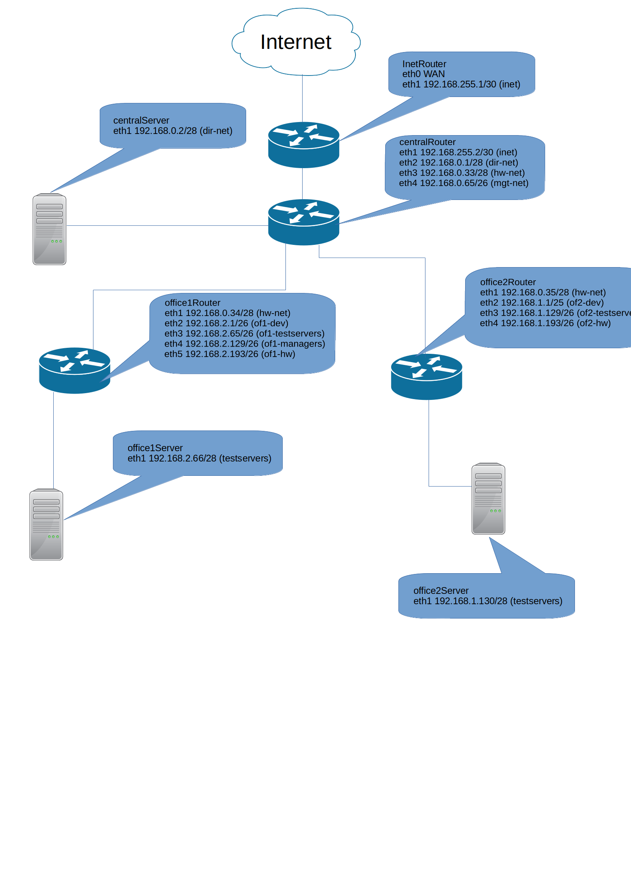

```bash
vagrunt up
```

Схема сети

Дано:
Сеть office1
- 192.168.2.0/26 - dev
- 192.168.2.64/26 - test servers
- 192.168.2.128/26 - managers
- 192.168.2.192/26 - office hardware

Сеть office2
- 192.168.1.0/25 - dev
- 192.168.1.128/26 - test servers
- 192.168.1.192/26 - office hardware


Сеть central
- 192.168.0.0/28 - directors
- 192.168.0.32/28 - office hardware
- 192.168.0.64/26 — wifi


Сети office1
1. 192.168.2.0/26 — Адрес сети  
    255.255.255.192 — Маска сети  
    192.168.2.63 — Broadcast адрес  
    62 — Кол-во свободных узлов

2. 192.168.2.64/26 — Адрес сети  
   255.255.255.192 — Маска сети  
   192.168.2.127 — Broadcast адрес  
   62 — Кол-во свободных узлов  

3. 192.168.2.128/26 — Адрес сети  
    255.255.255.192 — Маска сети  
    192.168.2.191 — Broadcast адрес  
   62 — Кол-во свободных узлов

4. 192.168.2.192/26 — Адрес сети  
    255.255.255.192 — Маска сети  
    192.168.2.255 — Broadcast адрес  
    62 — Кол-во свободных узлов


Сети office2
1. 192.168.1.0/25 — Адрес сети  
   255.255.255.128 — Маска сети  
   192.168.1.127 — Broadcast адрес  
 	 126 — Кол-во свободных узлов

2. 192.168.1.128/26 — Адрес сети  
   255.255.255.192 — Маска сети  
   192.168.1.191 — Broadcast адрес  
   62 — Кол-во свободных узлов

3. 192.168.1.192/26 — Адрес сети    
   255.255.255.192 — Маска сети   
   192.168.1.255 — Broadcast адрес    
 	 62 — Кол-во свободных узлов

Сети Central
1. 192.168.0.0/28 — Адрес сети  
   255.255.255.240 — Маска сети  
   192.168.1.15 — Broadcast адрес  
   14 — Кол-во свободных узлов

2. 192.168.0.32/28 — Адрес сети  
   255.255.255.240 — Маска сети  
   192.168.0.47 — Broadcast адрес  
   14 — Кол-во свободных узлов

3. 192.168.0.64/26 — Адрес сети  
   255.255.255.192 — Маска сети  
   192.168.0.127 — Broadcast адрес  
   62 — Кол-во свободных узлов

Свободные сети в сети Central:
1. 192.168.0.16/28 — Адрес сети  
   255.255.255.240 — Маска сети  
   192.168.0.31 — Broadcast адрес  
   14 — Кол-во свободных узлов

2. 192.168.0.48/28 — Адрес сети  
   255.255.255.240 — Маска сети  
   192.168.0.63 — Broadcast адрес  
	 14 — Кол-во свободных узлов


3. 192.168.0.128/25 — Адрес сети  
   255.255.255.128 — Маска сети  
   192.168.0.255 — Broadcast адрес  
 	 126 — Кол-во свободных узлов
